<style>
img{
    width: 40%;
}
</style>
# IoT Data Stream Mining
## Data Streams
 - 序列可能是无限的
 - 高数据量：线性空间
 - 高速到达：以次线性时间为例
 - 一旦流的元素已经被处理，它将被丢弃或归档

### MORRIS APPROXIMATE COUNTING ALGORITHM
  ```java
    Init counter c ← 0 //初始一个 计数器
      for every event in the stream //对于在流中收到的每一个event做如下操作
        do rand = random number between 0 and 1 //先随机一个数字
          if rand < p //如果这个数字小于某一个既定的概率值
          then c ← c + 1 //则让加速器+1
  ```
  然后就是去除以这个概率获得一个相对近似的值 比如说1/2的话 就是 c/0.5

### Find number of distinct items
  - Flajolet-Martin算法 不重复的数字的个数
    - https://greatpowerlaw.wordpress.com/2012/10/14/flajoletmartin/
    - stream:{4,1,2,3,2,4}
    - binary:{100,001,010,011,100}
    - r(a) = {2,0,1,0,2}
    - R = max(r(a)) = 2
    - Estimate = 2^R = 2 ^ 2 = 4
    ```java
      Init bitmap[0 . . . L − 1] ← 0    //初始化一个位图
      for every item x in the stream    // 对于在流中收到的每一个item
        do index = ρ(hash(x))           //首先转换成hash值的二进制，然后从左往右找出最近的一个1的位置
          if bitmap[index] = 0          // 如果位图上这个位置的值为0，则变为1
            then bitmap[index] = 1
      b ← position of leftmost zero in bitmap // 为图上从左往右 最近的一个0的位置
      return 2**b/0.77351 //计算获得不同的个数
    ```
    ```java
    Init M ← −∞             //初始化一个M为负无穷
      for every item x in the stream
        do M = max(M, ρ(h(x))    //M 为本身或者，hash值的二进制，然后从左往右找出最近的一个1的位置
      b ← M + 1 // 也就是最远的1的index+1
      return 2 ** b/0.77351
    ```
    - 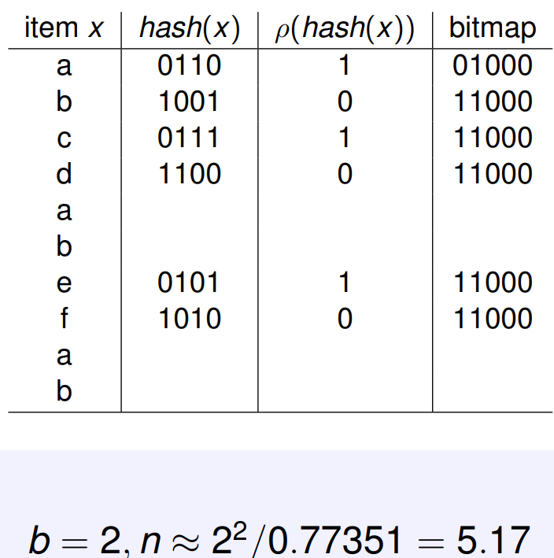

  - HYPERLOGLOG COUNTER
    - 演示地址：http://content.research.neustar.biz/blog/hll.html
    - 解释地址：https://www.youtube.com/watch?v=QSy5Y1lZtcs
    - 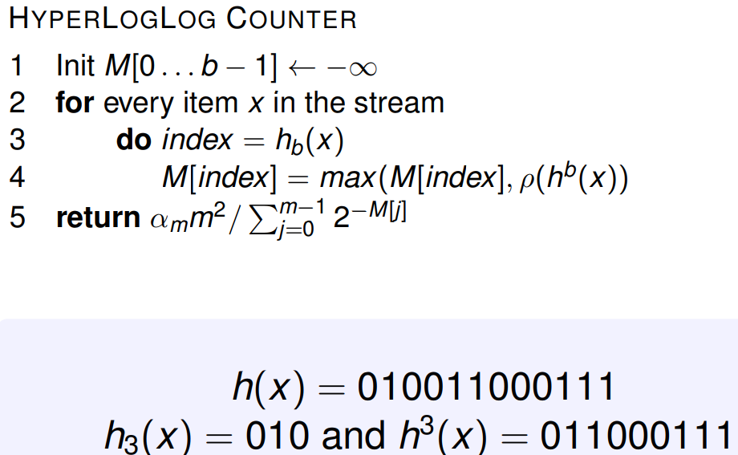
    - HLL和LL的区别在于最后的return的公司不一样
    - 首先我们初始化一个size为b的list，这个b为我们设置的值（调参）
    - 然后 定位到010 (2)这个index, 然后去寻找011000111中左往右最近的一个1，这里为2
    - 看下M[index]中的值，如果比这个小，就更新为这个

### Find most frequent items
  - MAJORITY 最多出现的一个item
    ```java
      Init counter c ← 0    // 初始化一个int
        for every item s in the stream
          do if counter is zero //如果c为0
              then pick up the item //就选择这个item
          do if item is the same // 如果相同
              then increment counter //+1
              else decrement counter //-1
    ```
    - 最后出现的这额能是最多的，因为如果他出现的次数最多，他肯定可以覆盖别的
    - 1,2,2,3,3,3,1 =>
    - 1,0,1,0,1,2,0

  - FREQUENT
    ```java
    for every item i in the stream
      do if item i is not monitored // top 10 监视区域
        do if < k items monitored //如果监视区域未满，且不在里面，则放进去并+1
          then add a new item with count 1
          else if an item z whose count is zero exists //如果满了，则看谁的count为0，如果为0则删除
            then replace this item z by the new one //并将其替换为新的一个item
            else decrement all counters by one //否则都+1
      else // 这个item已经在监视区域里面了
        increase its counter by one //全-1
    ```

  - LOSSYCOUNTING这个不太懂
    - 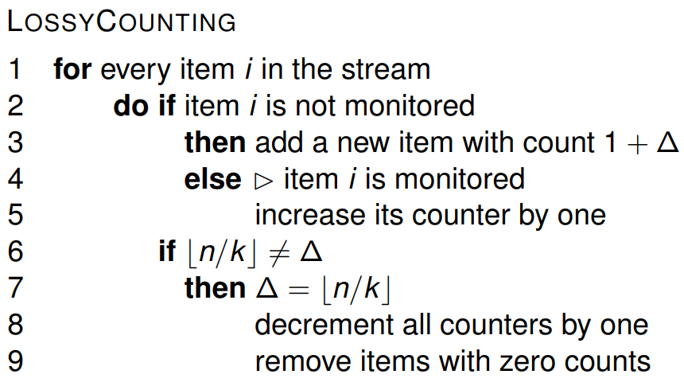

  - SPACE SAVING
    ```java
    for every item i in the stream
      do if item i is not monitored // top 10 监视区域
        do if < k items monitored //如果监视区域未满，且不在里面，则放进去并+1
          then add a new item with count 1
          else replace the item with lower counter //否则将最低的counter对应的item替换掉
            increase its counter by one //并counter++
        else ✄ item i is monitored //如果他在监视区域里面
          increase its counter by one //就对其++
    ```

    - CM-Sketch
      - computes frequency data adding and removing real values

      - RESERVOIR SAMPLING
        1. 申请一个长度为k的数组reservoir保存抽样。
        2. 保存首先接收到的k个元素
        3. 当接收到第i个新元素t时，以k/i的概率随机替换reservoir中的元素(即生成[1,i]间随机数j，若j<=k，则以t替换reservoir[j])

      ```java
        for every item i in the first k items of the stream //将stream的前k个储存到池里
          do store item i in the reservoir
        n = k //令N = K
        for every item i in the stream after the first k items of the stream //K之后的
          do select a random number r between 1 and n //从1-n中随机数
            if r < k //如果随机数比设置的k要小
              then replace item r in the reservoir with item i //然后replace[r]=item_i
            n = n + 1 //n++
      ```

### Mean and Variance 均值与方差
  - Given a stream x1, x2, . . . , xn
  - 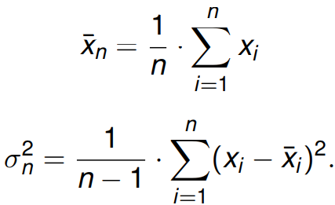
  ---
  - 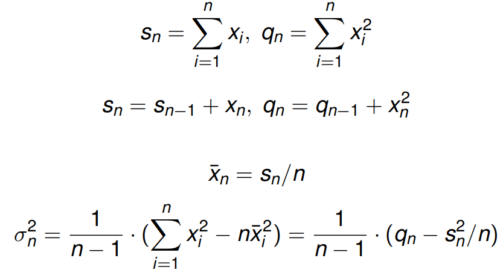
    - q是什么意思？？？？

### Data Stream Sliding Window 数据流滑动窗口
  - 10110001111 0101011 => 101100011110 1010111 => 1011000111101 0101110
  - We can maintain simple statistics over sliding windows, using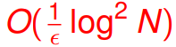space
    - N is the length of the sliding window
    -  is the accuracy parameter
  - Exponential Histograms
    - https://books.google.fr/books?id=uwiwHFLbbDAC&pg=PA62&lpg=PA62&dq=%3C+content+of+the+last+bucket+W/M&source=bl&ots=9RDl6yAirn&sig=YmNyb88-uG1ewUo6tHICCcS6fdc&hl=en&sa=X&ved=0ahUKEwiIx9i2qorZAhXkDMAKHRxuBdcQ6AEIKTAA#v=onepage&q&f=false
    - 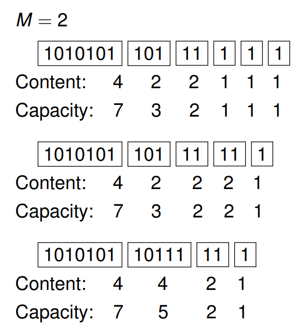
    - 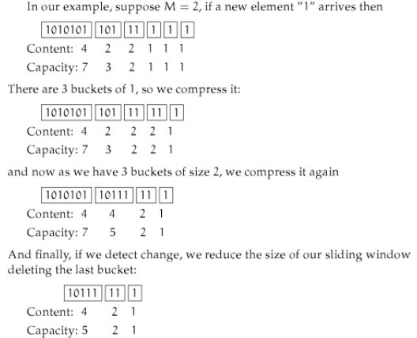

---

## Concept Drift
  - 概念漂移意味着模型尝试预测的目标变量的统计特性随着时间的推移以不可预知的方式发生变化。 这会导致因为随着时间的推移，预测变得不准确的问题。
  - 在商品销售应用中，概念漂移的一个原因可能是季节性，这意味着购物行为季节性变化。 例如，冬季假期的销售额可能比夏季高
  - 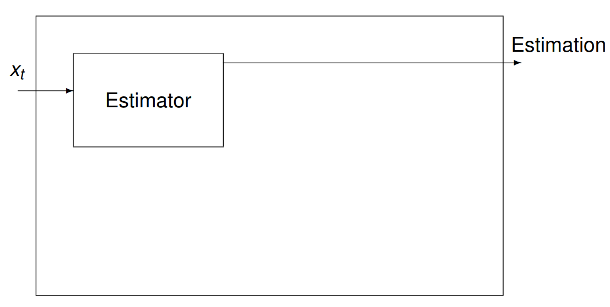 普通预测器进行预测
  -  检测到变化时预警
  - 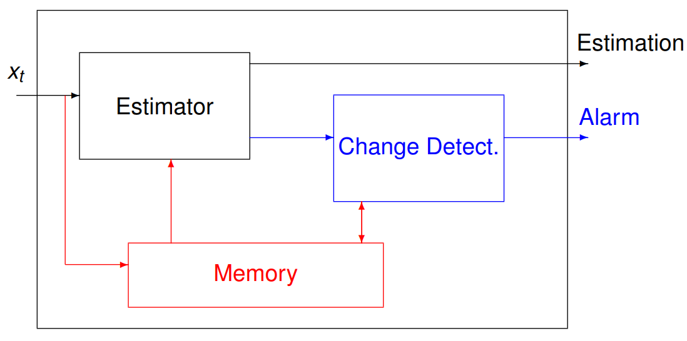 应该是去操作内存  内存交互？

### Concept Drift Evaluation
  - change detector 是用来检测真实的变化并且避免错误的预警的一种折中的设计
  所以我们需要满足几个条件：
    - 高准确率
    - 低平均检测时间，
    - 低假阳率（医学上：误判断其有病的概率 详细：http://blog.csdn.net/luo123n/article/details/48573397）
    - 低missed检测率
    - 低空间开销与时间花费
    - 要有理论做支撑
    - 不需要参数设置
    - CUSUM
      - 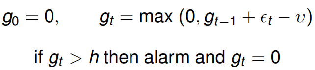 v和h是超参数
    - Page Hinckley 这个不太明白
      - 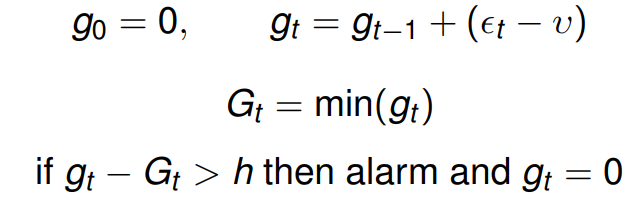
    - Geometric Moving Average
      - 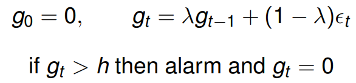这里面的λ是遗忘变量，被用作给上一个数据多或少权值
    - statistical test
      - 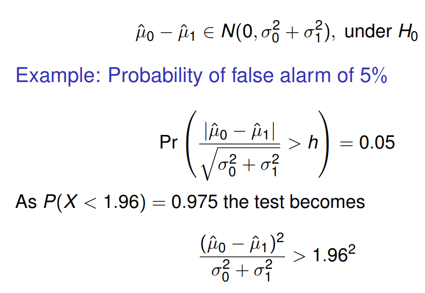
  - 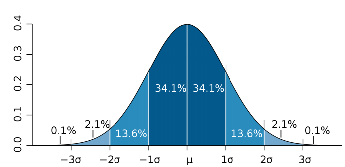 with 6 sigma
  - 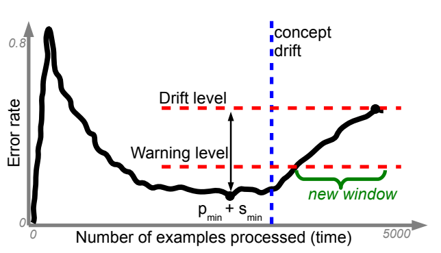
  - ADWIN: Adaptive Data Stream Sliding Window
    - 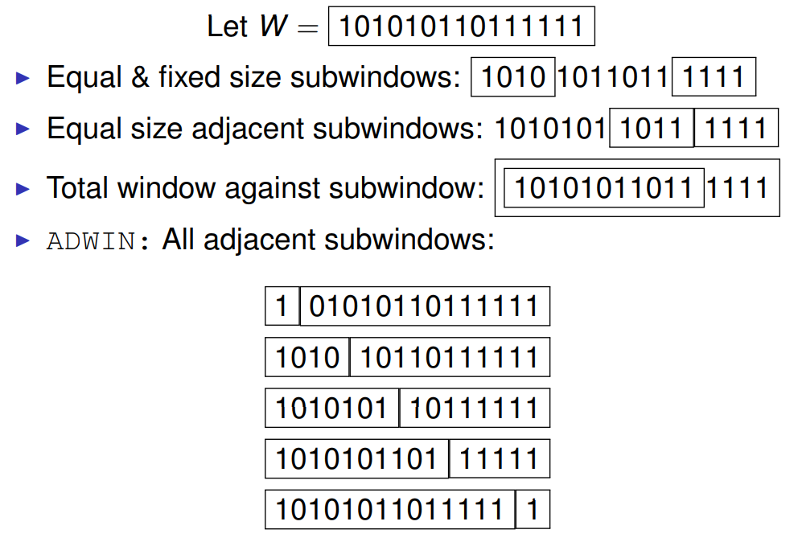
    - 我们可以通过滑动窗口保持简单的统计,Using 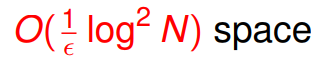, N 是滑窗的长度 另一个是准确度参数
    - 后面是算法和一些理论，<b>没太明白，但是应该挺重要的！！！！！！！！！！！！！</b>

---

## Evaluation
  - 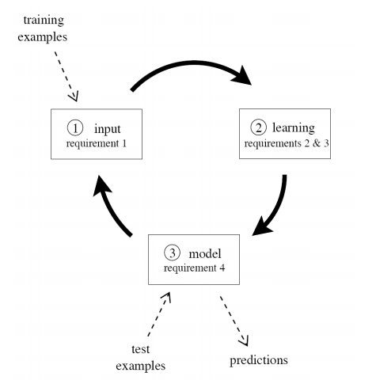
    1. 一次处理一个例子，只检查一次（最多）
    2. 使用有限的内存
    3. 在有限的时间中工作
    4. 随时准备好预测

### Evaluation Framework
  1. Error estimation: Hold-out or Prequential 误差估计
  2. Evaluation performance measures: Accuracy or κ-statistic 评估绩效评估
  3. Statistical significance validation: MacNemar or Nemenyi test 统计显着性验证

#### Error Estimation
  - Holdout Evaluation
    - 有可用于测试的数据
      1. 保留一个独立的测试集
      2. 将当前的决策模型定期应用于测试集
      3. 保留下来的估计损失是一个无偏估计量
    - 没有可用于测试的数据 Prequential or Interleaved-Test-Then-Train
      1. 从一系列例子中计算出一个模型的误差。
      2. 对于流中的每个item，实际模型都会进行预测，然后使用它来更新模型。

    - Hold-out is more accurate, but needs data for testing
      - 所以我们用prequential 去接近Hold-out
      - 使用滑动窗口或衰落因子估计精度

#### Evaluation performance measures
  - 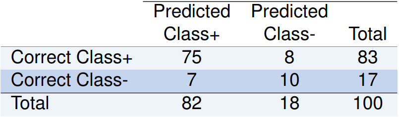
  - 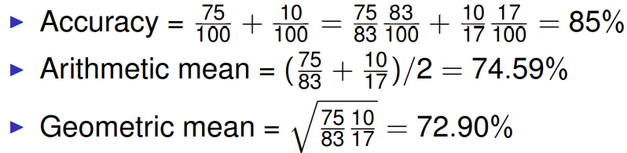

#### Performance Measures with Unbalanced Classes
  - Kappa
    - 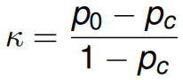
    - p0 classifier’s prequential accuracy (75+10)/100=0.85
    - pc 分类器做出正确预测的概率 (82*83+18*17)/100/100=0.7112
    - k = 0.85-0.7112/1-0.7112=48%
  - McNemar test
    - 
    - M = |a − b − 1| ** 2 /(a + b)
    - 在X^2分布下(卡布分布) confidence 置信度在0.99的时候，如果M> 6.635，则拒绝零假设（性能相等）
  - Nemenyi test
    - 没太明白
  - Cost Evaluation Example
    - 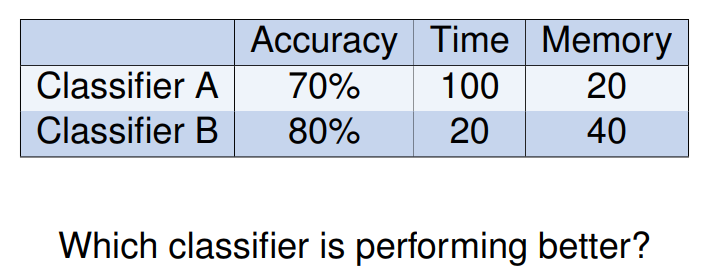
    - 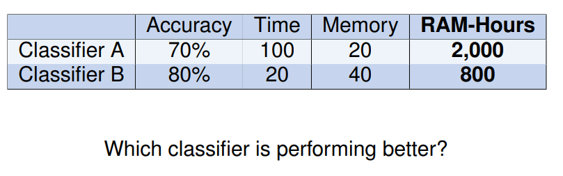

---

## Ensemble Methods
### Bagging
  - 现在我有4个数据：A,B,C,D
  - Classifier 1 使用的是B,A,C,B => A(1) B(2) C(1) D(0)
  - Classifier 2 使用的是D,B,A,D => A(1) B(1) C(0) D(2)
  - Classifier 3: B, A, C, B
  - Classifier 4: B, C, B, B
  - Classifier 5: D, C, A, C
  - Bagging 就是构建一些列基本models，用通过替换抽取随机样本的方式创建boostrap样本
  - 每个基本模型的训练集包含每个原始训练样例K次，其中P（K = k）遵循二项分布。(二项分布就是重复n次独立的伯努利试验。在每次试验中只有两种可能的结果，而且两种结果发生与否互相对立，并且相互独立，与其它各次试验结果无关，事件发生与否的概率在每一次独立试验中都保持不变) 当二项分布的n很大而p很小时，泊松分布可作为二项分布的近似，其中λ为np。通常当n≧20,p≦0.05时，就可以用泊松公式近似得计算
  - Oza and Russell
    - 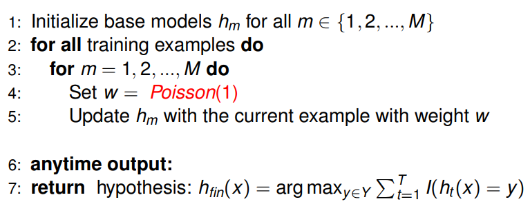
  - Hoeffding Option Tree
    - 包含附加选项节点的常规Hoeffding树允许应用多个测试，从而将多个Hoeffding树作为单独的路径。
  - Random Forests
    1. 输入训练集通过替换采样获得 (bagging)
    2. 树的节点只能使用固定数量的随机属性进行拆分
    3. 没有进行剪枝

#### Accuracy Weighted Ensemble (后期补充解释，并给出例子)
  - Process chunks of instances of size W
  - Builds a new classifier for each chunk
  - Removes old classifier
  - Weight each classifier using error
  - 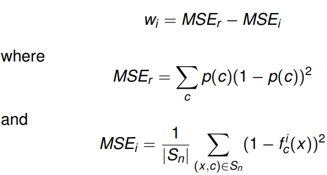

#### ADWIN Bagging (后期补充解释，并给出例子)
  - 懂了adwin再说

#### Leveraging Bagging for Evolving Data Streams 利用bagging进化数据流 (后期补充解释，并给出例子)
  - Leveraging Bagging
    - Using Poisson(λ) 泊松分布的参数λ是单位时间(或单位面积)内随机事件的平均发生率
    - 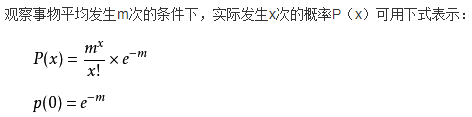
  - Leveraging Bagging MC
    - Using Poisson(λ) and Random Output Codes
  - Fast Leveraging Bagging ME
    - if an instance is misclassified: weight = 1
    - if not: weight = eT /(1 − eT ),
  - Empirical evaluation 实证评估
    - 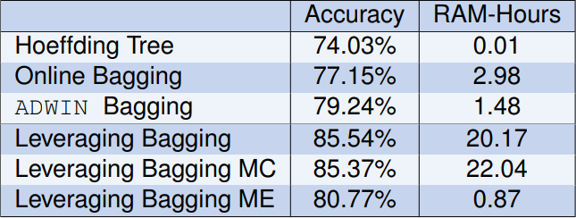

### Boosting (后期补充解释，并给出例子)
  - Boosting算法将弱model转化为强大的model
  - 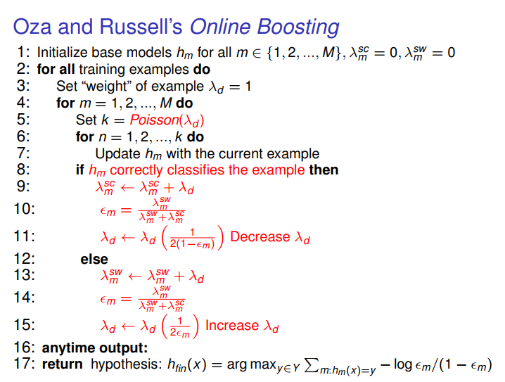

### Stacking
  - 使用分类器来组合基本分类器的预测
  - Restricted Hoeffding Trees
    - 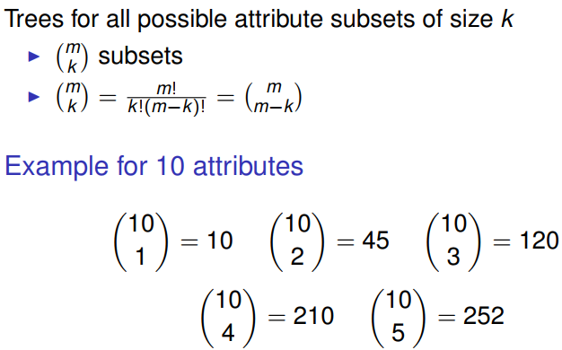  树的大小为k,总属性为m的所有可能的属性子集

## Classification
  - multi-label Classification 每个实例多个标签而不是一个标签
      y {<span style="color:blue">sunset</span>, people, <span style="color:blue">foliage</span>, beach, urban, field}
        {0，1}**6 = [1,0,1,0,0,0]
  - Single-label vs. Multi-label
    - 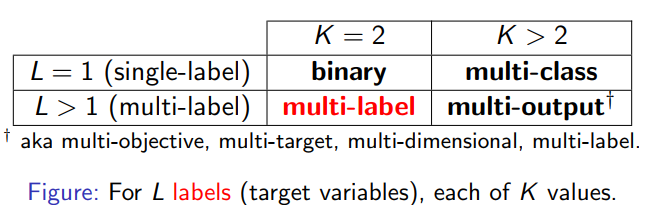
    - 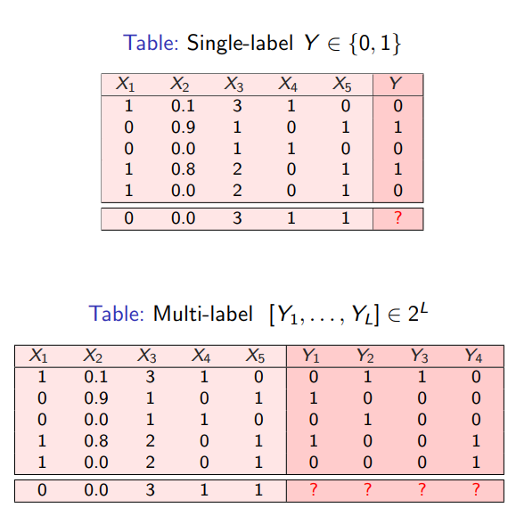
    - Notation
      - L = {sunset, people, foliage, beach, urban, field}
      - xi = 
      - produce predictions:
        -  [1, 0, 1, 0, 0, 0] ⇔ {sunset, foliage}

### Text Categorization and Tag Recommendation
  - 比如说在IMDb数据集中，同一个样本的label 可能既是恐怖片也是动作片，如下：
    - 

#### Probabilistic Models
  - (Single-label) Naive Bayes
    - 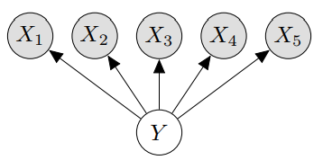
    - P(Y|X)是指在已知X的情况下，Y的概率是多少
    - P(X) 是指在所有的数据集中，当前样本的概率
    - P(Y) 是指label中的选项在所有数据集中的比例
    - P(X|Y) 是指在已知某一label的情况下，得出的样本是正确样本的概率
      - 然后我们假设变量X间是条件独立的
      - 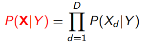
    -  最后以最大值为结果

  - Logistic Regression逻辑回归
    - 自己看公式


---

## Clustering
### k-means
  - Choose k initial centers C = {c1, . . . , ck }
  - 当停止条件没有被满足时
    - I For i = 1, . . . , N
      - find closest center ck ∈ C to each instance pi
      - assign instance pi to cluster Ck
    - For k = 1, . . . , K
      - set ck to be the center of mass of all points in C

### k-means++
  - Choose a initial center c1
  - For k = 2, . . . , K
    - select ck = p ∈ I with probability d**2(p, C)/cost(C, I)
  - 剩下的和k-means一样

### 性能测试：
  - 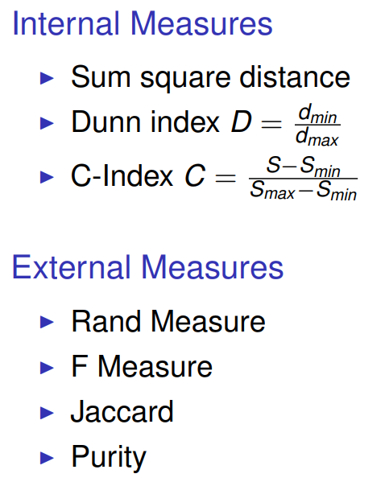

### BIRCH 之前讲过

### Clu-Stream
  - 使用微型群集在线存储统计信息
    - Clustering Features CF = (N, LS, SS, LT, ST)
    - N: numer of data points 数据点的数量
    - LS: linear sum of the N data points N个数据点的线性和
    - SS: square sum of the N data points N个数据点的平方和
    - LT: linear sum of the time stamps 时间戳的线性总和
    - ST: square sum of the time stamps 时间戳的平方总和
  - 在线阶段
    - 对于到达的每一个数据点
      - 这一点被一个micro-cluster吸收
      - 这一点就开始了自己的一个新的micro-cluster集群
        - delete oldest micro-cluster
        - merge two of the oldest micro-cluster
  - 离线阶段
    - Apply k-means using micro-clusters as points

### Density based methods
  - 基本的讲过了
  - DenStream
    - A-邻域（p）：距p小于或等于A的点集合
    - 核心对象：其A领域的整体权重至少为μ的对象
    - 密度区域：核心对象A邻域的联合
    - 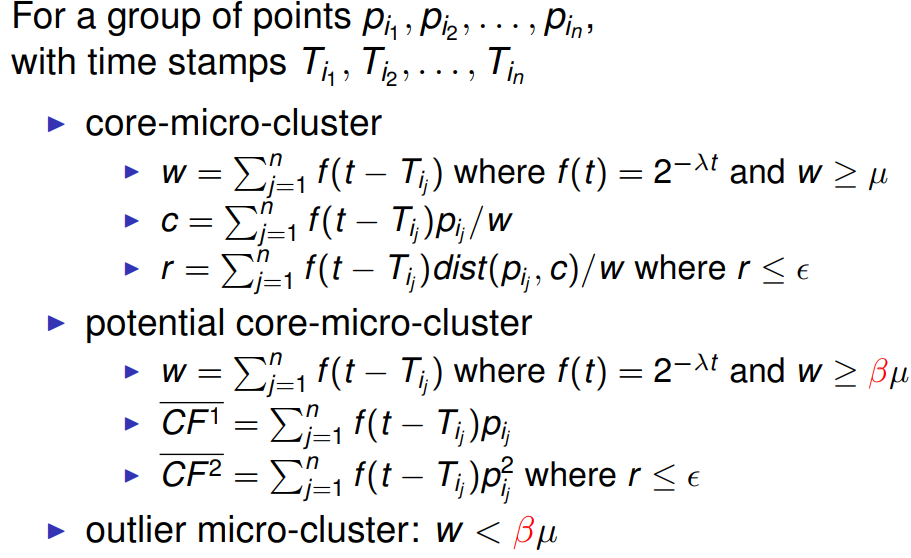
    - 在线阶段：
      - 
    - 离线阶段：
      - 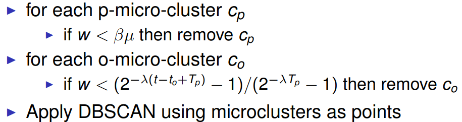

### ClusTree

### StreamKM++
